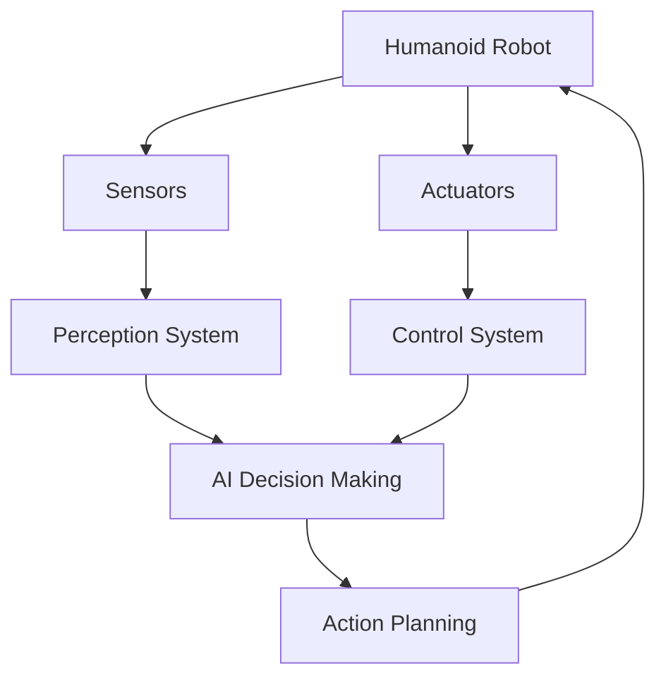

# Quick Start Guide: Physical AI and Humanoid Robotics Textbook

## Overview
This guide provides instructions for setting up the development environment and contributing to the Physical AI and Humanoid Robotics textbook project.

## Prerequisites

Before starting, ensure you have the following installed:

- **Node.js**: Version 18.x or higher
- **npm**: Version 8.x or higher (or yarn/pnpm)
- **Git**: For version control
- **Basic knowledge**: Python, AI/ML fundamentals, linear algebra, operating systems

## Environment Setup

### 1. Clone the Repository
```bash
git clone [repository-url]
cd physical_ai_book_humanoid
```

### 2. Install Dependencies
```bash
npm install
```

### 3. Verify Docusaurus Installation
```bash
npx docusaurus --version
```

## Local Development

### 1. Start Development Server
```bash
npm run start
```
This command starts a local development server and opens the application in your browser. Most changes are reflected live without having to restart the server.

### 2. Build for Production
```bash
npm run build
```
This command generates static content into the `build` directory and can be served using any static hosting service.

### 3. Test Production Build Locally
```bash
npm run serve
```

## Content Creation

### Adding a New Chapter

1. **Create the markdown file** in the appropriate module directory:
   ```
   docs/module-1-ros2/chapter-5-new-topic.md
   ```

2. **Use the required frontmatter**:
   ```markdown
   ---
   title: "Chapter Title"
   description: "Brief description for SEO"
   keywords: [list, of, relevant, keywords]
   sidebar_position: 5
   ---

   # Chapter Title

   ## Learning Objectives
   - Objective 1
   - Objective 2

   ## Prerequisites
   - Prerequisite knowledge

   ## Core Concepts
   [Content here]

   ## Implementation
   [Practical application]

   ## Examples
   [Worked examples]

   ## Summary
   [Key takeaways]

   ## Exercises
   1. **Conceptual**: [Question]
   2. **Logical**: [Question]
   3. **Implementation**: [Question]
   ```

3. **Update sidebars.js** to include the new chapter in the navigation.

### Adding Code Examples

All code examples must follow these requirements:

```python
# Example: ROS 2 Node Implementation
# WHAT: This code creates a simple ROS 2 publisher node
# WHY: To demonstrate basic ROS 2 publisher functionality

import rclpy
from rclpy.node import Node
from std_msgs.msg import String

class MinimalPublisher(Node):
    def __init__(self):
        super().__init__('minimal_publisher')
        self.publisher_ = self.create_publisher(String, 'topic', 10)
        timer_period = 0.5  # seconds
        self.timer = self.create_timer(timer_period, self.timer_callback)
        self.i = 0

    def timer_callback(self):
        msg = String()
        msg.data = 'Hello World: %d' % self.i
        self.publisher_.publish(msg)
        self.get_logger().info('Publishing: "%s"' % msg.data)
        self.i += 1

def main(args=None):
    rclpy.init(args=args)
    minimal_publisher = MinimalPublisher()
    rclpy.spin(minimal_publisher)
    minimal_publisher.destroy_node()
    rclpy.shutdown()

if __name__ == '__main__':
    main()
```

**Dependencies**: `rclpy` version Kilted Kaiju (2025)

### Adding Mathematical Equations

All mathematical equations must include either a derivation or citation:

```markdown
## Forward Kinematics

The position of the end effector can be calculated using:

$$
T = \prod_{i=1}^{n} ^{i-1}A_i
$$

**Derivation**: [Step-by-step mathematical derivation here]

**Alternative**: For more details, see Craig, J.J. (2005). *Introduction to Robotics: Mechanics and Control*. Pearson. Chapter 3.
```

### Adding Diagrams

Use Mermaid for all diagrams:



## Technology Stack

### ROS 2 (Kilted Kaiju)
- **Version**: ROS 2 Kilted Kaiju (2025)
- **Usage**: Robotic Nervous System (Module 1)

### NVIDIA Isaac Sim (5.0)
- **Version**: Isaac Sim 5.0
- **Usage**: AI-Robot Brain (Module 3)

### Modern Gazebo (Jetty/Gz)
- **Version**: Latest Jetty/Gz
- **Usage**: Digital Twin (Module 2)

### OpenAI Whisper
- **Usage**: Speech recognition (Module 4)

## Quality Assurance

### Before Submitting Changes

1. **Run spell check**:
   ```bash
   # Use your preferred spell checking tool
   ```

2. **Check for broken links**:
   ```bash
   npm run build
   # Docusaurus will report any broken links
   ```

3. **Validate build**:
   ```bash
   npm run build
   # Ensure there are zero warnings or errors
   ```

### Content Standards

- **Citations**: All external information must be cited in APA format
- **Code**: All examples must be complete, executable with WHAT/WHY comments
- **Math**: All equations must include derivation or citation
- **Exercises**: Each chapter must have 3+ exercises (conceptual, logical, implementation)
- **Diagrams**: Use Mermaid for all visual representations

## Deployment

The textbook is automatically deployed to GitHub Pages when changes are merged to the main branch.

### Manual Deployment (if needed)
```bash
GIT_USER=<Your GitHub username> USE_SSH=true npm run deploy
```

## MCP Context7 Usage

**CRITICAL**: The exact phrase "use context7" must be used verbatim for all setup/config tasks:

- Docusaurus configuration
- Sidebar setup
- Plugin configuration
- Build commands
- Deployment workflows
- ROS 2 examples
- URDF files
- Gazebo configurations
- Isaac Sim setups

Example:
```
use context7 to configure Docusaurus sidebar
```

## File Structure

```
physical_ai_book_humanoid/
├── docs/                   # Textbook content
│   ├── intro.md
│   ├── notation.md
│   ├── glossary.md
│   ├── module-1-ros2/
│   ├── module-2-digital-twin/
│   ├── module-3-ai-brain/
│   ├── module-4-vla/
│   └── capstone/
├── static/                 # Static assets
├── src/                    # Custom components
├── docusaurus.config.js    # Site configuration
├── sidebars.js             # Navigation structure
└── package.json            # Dependencies
```

## Getting Help

- For technical issues: Check the [Troubleshooting Guide](./troubleshooting.md)
- For content questions: Refer to the [Style Guide](./style-guide.md)
- For process questions: Review the [Contribution Guidelines](./contribution.md)